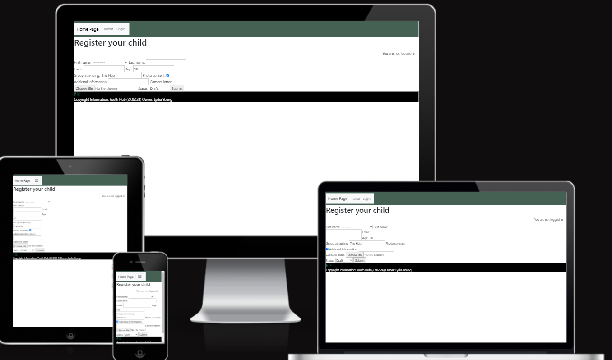

## Project Name : The Youth Hub

Live depolyed site: https://8000-lydiajoy97-youthclub-xju7f59om9x.ws-eu108.gitpod.io/

# **TABLE OF Contents**

* [**Project Brief**](#Project-Brief)
* [**User Experience** ](#User-experience)
* [**User Stories**](#User-Stories)
* [**Surface-plan**](#Surface-plan)
* [**Features** ](#Features)
* [ **Testing**](#Testing)
* [ **Deployment**](#Deployment)
* [**Credits** ](#Credits)
* [**Acknowledgements** ](#Acknowledgements)

# Project Brief
This is a website where parents or guardians can register there child to the youth club or make enquires using the webistes messaging service.

# User Stories
1. As a user I would like to find out more about the youth club and register my child. 
2. As a user I want to be able to upload and delete form information to register my child to the youth group. 
3. As an administrator I want to be able to manage users.

# Features
Each custom model should have the CRUD functionality. I have detailed each models functionality below.
1. CRUD Functionality of the registration model:
Create- To be able to register your child to the youth club. 
Read- To be able to see your information uploaded once you have logged in. This needs to be secure to each user as it is personal date.
Update- To be able to update your information were applicable.
Delete- To be able to delete any information that no longer applies to your child or their application.

2. Other features:
- A log in page for users so that their information is secure.
- Navagation links to each page for best user experience.

# Surface Plan

# Testing
To test my project I will try and create an account and register a child using the form upload page. 
I have created a testing table which you can view below. 

# Summary
The navagation links all work well and go to the correct pages. When you log in you are redirected to the form page which is correct. 

One error that I ran into was during migrations. I wanted to update my model after an inital migration. To fix this I had to delete the migration files and run migrations again.

Another error that I found was getting the form model to display on the html page. 
Another error that I ran into whilst trying to solve this one was an attritute error. After following the paths I realised the attribute error came from the URL path. Once I changed this to match the view name it was fixed. 
I also realised that my form was still not being displayed. This was because I was trying to pull the models as a list from the database instead of creating a form. To fix this I created a form.py file and created the class based view to pull that. My form now displays correctly and users can submit. 

When trying to add the Edit and Delete fuctionalities I ran into errors. I started by following the tutorials credited, but then my url path broke. This remains un-fixed and I have been unsucessful in creating a site with full CRUD funtionalities. 

# Testing Results

To veiw my testing table please follow this link. 

https://docs.google.com/document/d/1mBo_uNo2pwG0C7uNdOIpEvz9kHZVioFogS3kHh2kR0U/edit?usp=sharing

# Credits

https://developer.mozilla.org/en-US/docs/Learn/Server-side/Django/Home_page

https://chat.openai.com/c/cbe930a4-4488-499c-bf87-af5dfda6ba9b

https://docs.djangoproject.com/en/5.0/intro/tutorial03/

Form writing:

https://stackoverflow.com/questions/9051551/is-it-possible-to-return-an-httpresponse-in-django-with-text-a-json-object 

https://docs.djangoproject.com/en/5.0/topics/http/file-uploads/

Module not found error:

https://stackoverflow.com/questions/47362122/django-modulenotfounderror

https://dev.to/gauravzaiswal/thwo-most-common-cause-of-django-import-error-no-module-named-in-django-35h2

https://stackoverflow.com/questions/73786373/in-django-why-i-cannot-import-a-model-in-an-python-file-created-by-me-in-inside#:~:text=You%20will%20end%20up%20importing,you%20only%20import%20that%20module. 

Models:

https://www.google.co.uk/search?q=how+do+you+do+a+checkbox+on+django+model+field&sca_esv=682fb458cb082d73&sca_upv=1&source=hp&ei=UWfYZfPBC9eRhbIP0eCj2AI&iflsig=ANes7DEAAAAAZdh1YeKFz7nYx90_vB3qqa-yiWcenskS&oq=how+do+you+do+a+checkbox+on+django+mo&gs_lp=Egdnd3Mtd2l6IiVob3cgZG8geW91IGRvIGEgY2hlY2tib3ggb24gZGphbmdvIG1vKgIIATIFECEYoAEyBRAhGKABMgUQIRigAUjxU1AAWOBFcAF4AJABApgBsQigAbUpqgENMjMuMTUuNS0xLjAuMbgBA8gBAPgBAcICCxAAGIAEGLEDGIMBwgIOEC4YxwEYsQMY0QMYgATCAhEQLhiABBixAxiDARjHARjRA8ICDhAuGIAEGLEDGMcBGNEDwgIOEC4YgAQYigUYsQMYgwHCAhEQLhiABBixAxjHARivARiOBcICCxAuGIAEGMcBGNEDwgIFEAAYgATCAgsQABiABBiKBRixA8ICDhAAGIAEGIoFGLEDGIMBwgIHEAAYgAQYCsICBRAuGIAEwgIHEC4YgAQYCsICChAAGIAEGEYY-wHCAgsQLhiABBixAxjUAsICBBAAGAPCAggQABiABBixA8ICCxAuGIAEGIoFGLEDwgILEC4YgAQYxwEYrwHCAgYQABgWGB7CAggQABgWGB4YD8ICCBAAGBYYHhgKwgILEAAYgAQYigUYhgPCAgUQIRifBcICBxAhGAoYoAE&sclient=gws-wiz#fpstate=ive&vld=cid:f60fbe1f,vid:y71nYvrs_IY,st:0

https://stackoverflow.com/questions/7341066/can-i-make-an-admin-field-not-required-in-django-without-creating-a-form

https://stackoverflow.com/questions/22212479/display-date-of-birth-in-django-app

https://stackoverflow.com/questions/13225890/django-default-timezone-now-saves-records-using-the-old-time-of-when-the-d

https://developer.mozilla.org/en-US/docs/Learn/Server-side/Django/Models 

https://stackoverflow.com/questions/3106295/django-get-list-of-model-fields 

install summernote:

https://github.com/summernote/django-summernote

HTTP Responses:

https://docs.djangoproject.com/en/5.0/topics/http/shortcuts/ 

https://stackoverflow.com/questions/26258905/the-view-didnt-return-an-httpresponse-object-it-returned-none-instead 

Template location:

https://stackoverflow.com/questions/1926049/django-templatedoesnotexist 

https://stackoverflow.com/questions/3038459/what-is-the-path-that-django-uses-for-locating-and-loading-templates

https://docs.djangoproject.com/en/dev/topics/templates/#django.template.backends.base.Template.render

redirectafter log in: 

https://stackoverflow.com/questions/4870619/django-after-login-redirect-user-to-his-custom-page-mysite-com-username

csrf token:

https://stackoverflow.com/questions/3289860/how-can-i-embed-django-csrf-token-straight-into-html 

form:
https://www.geeksforgeeks.org/how-to-create-a-form-using-django-forms/?ref=next_article 

https://www.youtube.com/watch?v=EX6Tt-ZW0so 

https://docs.djangoproject.com/en/5.0/topics/forms/modelforms/ 

https://stackoverflow.com/questions/69413424/django-attributeerror-wsgirequest-object-has-no-attribute-get 

https://www.pythontutorial.net/django-tutorial/django-delete-form/ 

https://docs.djangoproject.com/en/5.0/topics/forms/formsets/#dealing-with-ordering-and-deletion-of-forms 

Other websites:

https://docs.djangoproject.com/en/5.0/ref/contrib/admin/

https://stackoverflow.com/questions/34217400/function-object-has-no-attribute-as-view

https://docs.djangoproject.com/en/5.0/ref/class-based-views/generic-display/

https://www.youtube.com/watch?v=4vi42R4B-OQ 

# Contents
Chat GBT was used to right the contents on the home page. 

The hero image is my own image taken at a previous workplace.

# Deployment
To deploy to heroku I set up the app on the dashboard. 
I then clicked deploy to the main branch and opened the app.

# Acknowledgemnts

