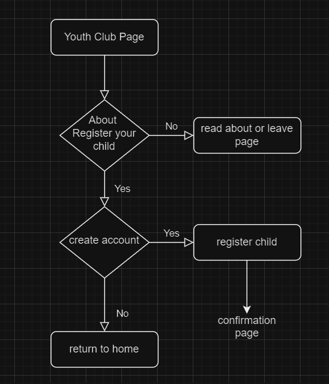
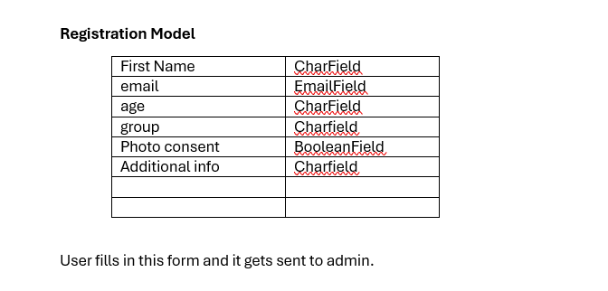
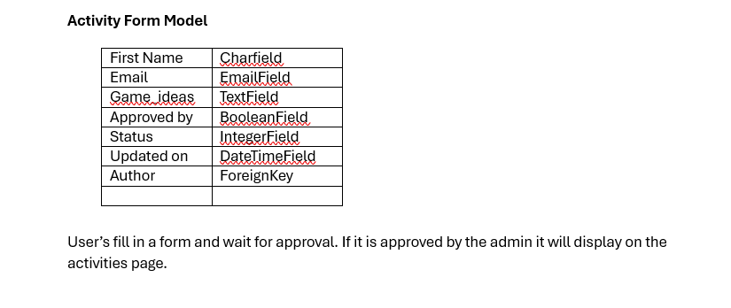
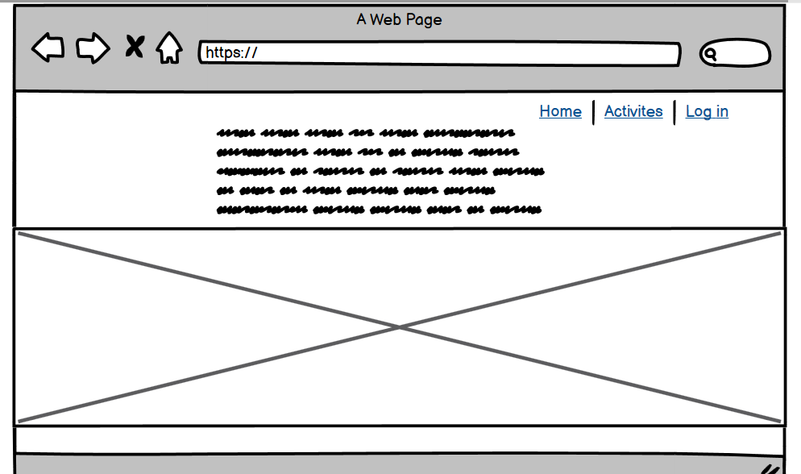
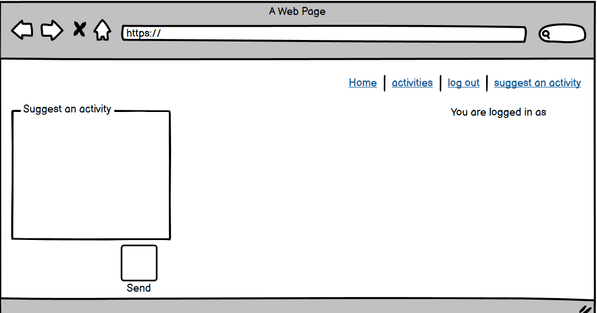
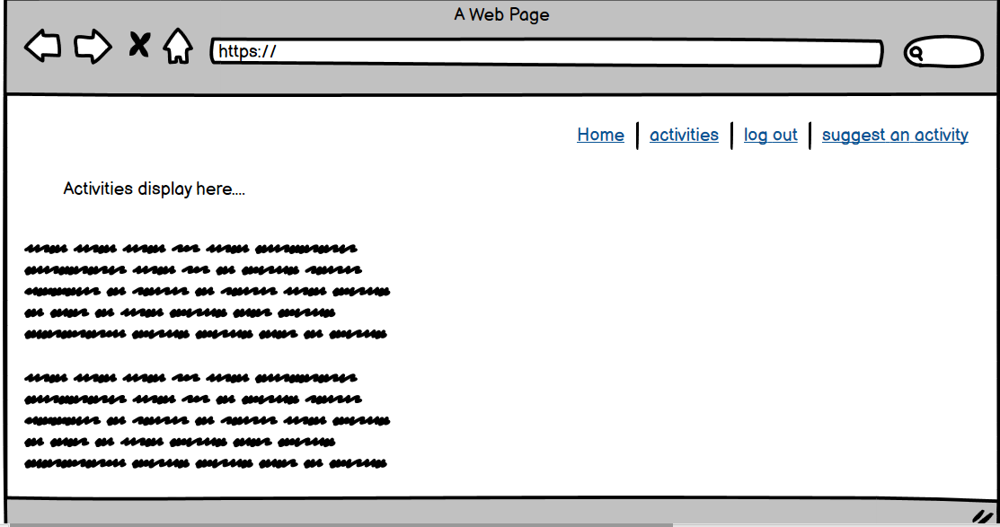
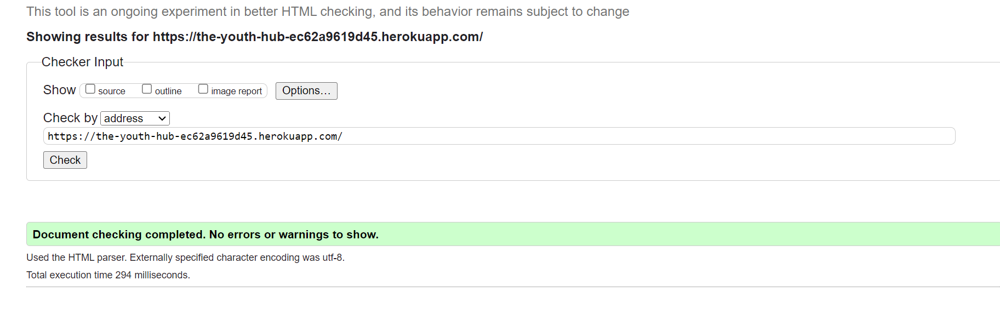

## Project Name : The Youth Hub

Live depolyed site: https://the-youth-hub-ec62a9619d45.herokuapp.com/

# **TABLE OF Contents**

* [**Project Brief**](#Project-Brief)
* [**User Experience** ](#User-experience)
* [**User Stories**](#User-Stories)
* [**Surface-plan**](#Surface-plan)
* [**Features** ](#Features)
* [ **Testing**](#Testing)
* [ **Deployment**](#Deployment)
* [**Credits** ](#Credits)
* [**Acknowledgements** ](#Acknowledgements)

# Project Brief
This is a website where parents or guardians can register there child to the youth club and youth or parents can suggest activites for the Youth Hub. 

# User Stories
1. As a user I would like to find out more about the youth club and register my child. 
2. As a user I want to be able to suggest an activity for the youth club.
3. As a user I want to be able to edit and delete my suggested activity incase I need to.
4. As an administrator I want to be able to manage users, delete and edit posts and approve all posts.

# Features
Each custom model should have the CRUD functionality. I have detailed each models functionality below.
1. CRUD Functionality of the activites model:
Create- To be able to suggest an activity 
Read- To be able to see your post on the activites list page and read other users posts.
Update- To be able to update the suggested activity post if the correct user is logged in.
Delete- To be able to delete and the post if the correct user is logged in.

2. Other features:
- A log in page 
- A log out page 
- A sign up page
- A read-only about page 
- A upload form page 
- A home page
- A form to suggest activity 
- A page to read the activities posted by a user
- User authentication
- Update & Delete functions if the user is authenticated
- Navagation links to each page for best user experience.

# Surface Plan

After the inital plan I realised that the upload form alone would not contain the full crud functionality like update and delete. I therefore decided to add the activities suggestion app where a user can post, update and delete.

My form models are as follows. 

These are my project wireframes. 

# Testing
To test my project I will try and create an account and register a child using the form upload page. 
I will also test creating an account, logging in and out and that the logged in username is displayed. 
I will also test the ability to post an activity and edit and delete it as well as reading other posts.
My friends and family have also tested creating an account and uploading forms.

I have created a testing table which you can view below. 

# Summary
The navigation links all work well and go to the correct pages. When you log in you are redirected to the form page which is correct. 

One error that I ran into was during migrations. I wanted to update my model after an inital migration. To fix this I had to delete the migration files and run migrations again.

Another error that I ran into whilst trying to solve this one was an attribute error. After following the paths I realised the attribute error came from the URL path. Once I changed this to match the view name it was fixed. 
I also realised that my form was still not being displayed. This was because I was trying to pull the models as a list from the database instead of creating a form. To fix this I created a form.py file and created the class based view to pull that. My form now displays correctly and users can submit. 

# Testing Results

To veiw my testing table please follow this link. 

https://docs.google.com/document/d/1mBo_uNo2pwG0C7uNdOIpEvz9kHZVioFogS3kHh2kR0U/edit?usp=sharing

I struggled throughout the project to fix the footer to the bottom of the page without it covering up text.
To solve this I added page padding to the bottom of the body so that it leaves room between the footer and content. 
This now works and my footer is not covering anything. 

Also my image is slightly streached on large screens. It's responsive, but doesn't look good to the user. 

Another error that a user ran into was that they could not upload the form from Android firefox. They tried again after some time and it worked. I had fixed some indentation issues which may have helped resolve this.

My project passed through the w3 validator on all but two pages. On the form/post page it showed a stray start tag error. I was unable to locate this, so the bug remains.
Also on the /activities page it shows stray divs which I am unable to locate and fix.

# Credits

Building blog for Activities app by code.any:
https://www.youtube.com/watch?v=CnaB4Nb0-R8 

https://www.youtube.com/watch?v=mpfHDSmqHds

Edit and Delete features by Code.any:

https://www.youtube.com/watch?v=J7xaESAddDQ&list=PLCC34OHNcOtr025c1kHSPrnP18YPB-NFi&index=6

https://www.youtube.com/watch?v=8NPOwmtupiI&list=PLCC34OHNcOtr025c1kHSPrnP18YPB-NFi&index=7

Other Code.any video:

https://www.youtube.com/watch?v=Y1Us5jVT07E&list=PLCC34OHNcOtr025c1kHSPrnP18YPB-NFi&index=16

fix author field activites page: 
Code used from Youtube comments by user nishanthmuruganantham3590:
https://www.youtube.com/watch?v=TAH01Iy5AuE 

https://developer.mozilla.org/en-US/docs/Learn/Server-side/Django/Home_page

https://chat.openai.com/c/cbe930a4-4488-499c-bf87-af5dfda6ba9b

https://docs.djangoproject.com/en/5.0/intro/tutorial03/

Media queries:
https://www.w3schools.com/css/css_rwd_mediaqueries.asp 
https://developer.mozilla.org/en-US/docs/Web/CSS/CSS_media_queries/Using_media_queries

responsive grid:
https://www.youtube.com/watch?v=68O6eOGAGqA 

Form writing:

https://stackoverflow.com/questions/9051551/is-it-possible-to-return-an-httpresponse-in-django-with-text-a-json-object 

https://docs.djangoproject.com/en/5.0/topics/http/file-uploads/

Module not found error:

https://stackoverflow.com/questions/47362122/django-modulenotfounderror

https://dev.to/gauravzaiswal/thwo-most-common-cause-of-django-import-error-no-module-named-in-django-35h2

https://stackoverflow.com/questions/73786373/in-django-why-i-cannot-import-a-model-in-an-python-file-created-by-me-in-inside#:~:text=You%20will%20end%20up%20importing,you%20only%20import%20that%20module. 

Models:

https://www.google.co.uk/search?q=how+do+you+do+a+checkbox+on+django+model+field&sca_esv=682fb458cb082d73&sca_upv=1&source=hp&ei=UWfYZfPBC9eRhbIP0eCj2AI&iflsig=ANes7DEAAAAAZdh1YeKFz7nYx90_vB3qqa-yiWcenskS&oq=how+do+you+do+a+checkbox+on+django+mo&gs_lp=Egdnd3Mtd2l6IiVob3cgZG8geW91IGRvIGEgY2hlY2tib3ggb24gZGphbmdvIG1vKgIIATIFECEYoAEyBRAhGKABMgUQIRigAUjxU1AAWOBFcAF4AJABApgBsQigAbUpqgENMjMuMTUuNS0xLjAuMbgBA8gBAPgBAcICCxAAGIAEGLEDGIMBwgIOEC4YxwEYsQMY0QMYgATCAhEQLhiABBixAxiDARjHARjRA8ICDhAuGIAEGLEDGMcBGNEDwgIOEC4YgAQYigUYsQMYgwHCAhEQLhiABBixAxjHARivARiOBcICCxAuGIAEGMcBGNEDwgIFEAAYgATCAgsQABiABBiKBRixA8ICDhAAGIAEGIoFGLEDGIMBwgIHEAAYgAQYCsICBRAuGIAEwgIHEC4YgAQYCsICChAAGIAEGEYY-wHCAgsQLhiABBixAxjUAsICBBAAGAPCAggQABiABBixA8ICCxAuGIAEGIoFGLEDwgILEC4YgAQYxwEYrwHCAgYQABgWGB7CAggQABgWGB4YD8ICCBAAGBYYHhgKwgILEAAYgAQYigUYhgPCAgUQIRifBcICBxAhGAoYoAE&sclient=gws-wiz#fpstate=ive&vld=cid:f60fbe1f,vid:y71nYvrs_IY,st:0

https://stackoverflow.com/questions/7341066/can-i-make-an-admin-field-not-required-in-django-without-creating-a-form

https://stackoverflow.com/questions/22212479/display-date-of-birth-in-django-app

https://stackoverflow.com/questions/13225890/django-default-timezone-now-saves-records-using-the-old-time-of-when-the-d

https://developer.mozilla.org/en-US/docs/Learn/Server-side/Django/Models 

https://stackoverflow.com/questions/3106295/django-get-list-of-model-fields 

install summernote:

https://github.com/summernote/django-summernote

HTTP Responses:

https://docs.djangoproject.com/en/5.0/topics/http/shortcuts/ 

https://stackoverflow.com/questions/26258905/the-view-didnt-return-an-httpresponse-object-it-returned-none-instead 

Template location:

https://stackoverflow.com/questions/1926049/django-templatedoesnotexist 

https://stackoverflow.com/questions/3038459/what-is-the-path-that-django-uses-for-locating-and-loading-templates

https://docs.djangoproject.com/en/dev/topics/templates/#django.template.backends.base.Template.render

redirectafter log in: 

https://stackoverflow.com/questions/4870619/django-after-login-redirect-user-to-his-custom-page-mysite-com-username

csrf token:

https://stackoverflow.com/questions/3289860/how-can-i-embed-django-csrf-token-straight-into-html 

form:
https://www.geeksforgeeks.org/how-to-create-a-form-using-django-forms/?ref=next_article 

https://www.youtube.com/watch?v=EX6Tt-ZW0so 

https://docs.djangoproject.com/en/5.0/topics/forms/modelforms/ 

https://stackoverflow.com/questions/69413424/django-attributeerror-wsgirequest-object-has-no-attribute-get 

https://www.pythontutorial.net/django-tutorial/django-delete-form/ 

https://docs.djangoproject.com/en/5.0/topics/forms/formsets/#dealing-with-ordering-and-deletion-of-forms 

Other websites:

https://docs.djangoproject.com/en/5.0/ref/contrib/admin/

https://stackoverflow.com/questions/34217400/function-object-has-no-attribute-as-view

https://docs.djangoproject.com/en/5.0/ref/class-based-views/generic-display/

https://www.youtube.com/watch?v=4vi42R4B-OQ 

https://stackoverflow.com/questions/25376741/send-custom-message-in-django-permissiondenied

https://www.youtube.com/watch?v=Y1Us5jVT07E

https://docs.djangoproject.com/en/4.1/topics/auth/customizing/#authentication-backends

https://www.reddit.com/r/djangolearning/comments/15tbpiw/django_dont_display_the_id_of_a_foreignkey_but/

# Contents
Chat GBT was used to right the contents on the about page. 
The hero image on the home page is my own image taken at a previous workplace.

# Deployment
I first set up an instance on Elphant SQL to get my database url.
To deploy my project I navigated to heroku and created my app. I then added the DISABLE_COLLECTSTATIC key and ensured my cloundinary url and database url matched. 
I then installed gunicorn and added it to the requirements.txt file. After this I added a file called Procfile and added the command to execute my project with my project name included.
I then made sure heroku was an ALLOWED_HOST in my settings.py file. 
Finally, to deploy to heroku set debug to false and pushed my commits. 

I made sure that automatic deploys where swictch on so that every push I commit updates the live site.

My app is now deployed.

# Acknowledgemnts

Huge thank you to my mentor for your help and encouragement! 